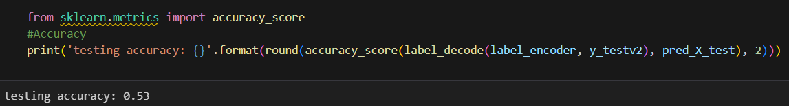

# DM-2024 Lab2 HW
code by 111060026 daisyliu0225

---
# Adapted Versions
## Code 1: BOW+Deep learning
The code in the repo is: 
### Versions
|Version|Max Features|Train Data Sample|epoch|batch size|    Result    |
|-------|------------|-----------------|-----|----------|--------------|
|Original|    500    |      0.3        |25   |32        |    0.36322   |
|Version 1|    500   |      0.3        |25   |40        |    0.36322   |
|Version 2|    500   |      0.3        |40   |32        |    0.36322   |
|Version 3|    1000  |      0.3        |40   |512       |    0.37987   |
|Version 4|    2000  |      0.3        |40   |512       |    0.37959   |
|Version 5|    1800  |      0.3        |40   |512       |    0.38144   |
|Version 6|    1800  |       1         |40   |512       |    0.41604   |

A few conclusions:
1. epoch and batch size does not significant affect the result
2. Train data sample can affect the result(I did not test it on kaggle), but I had a small "accuracy test label" that helps me test what is going on in my code. 

3. The number of max features has a limit and will decrease if exceed the limit. The limit in this data is around 1800.

---
# Discarded Versions
## Code 1: 

